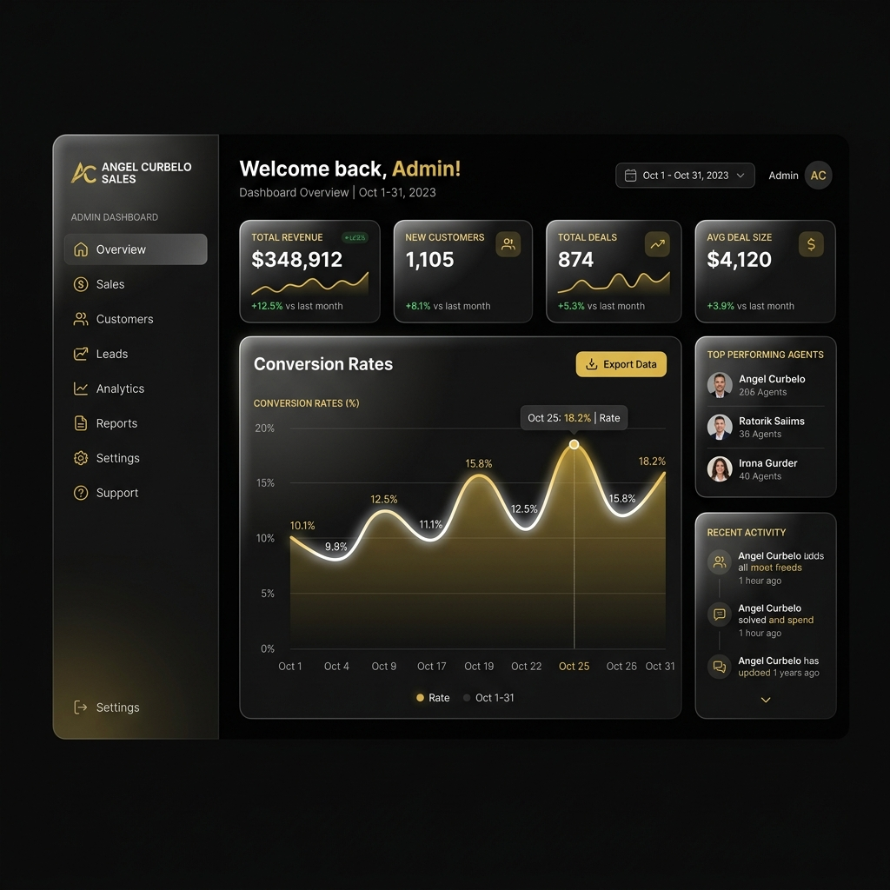
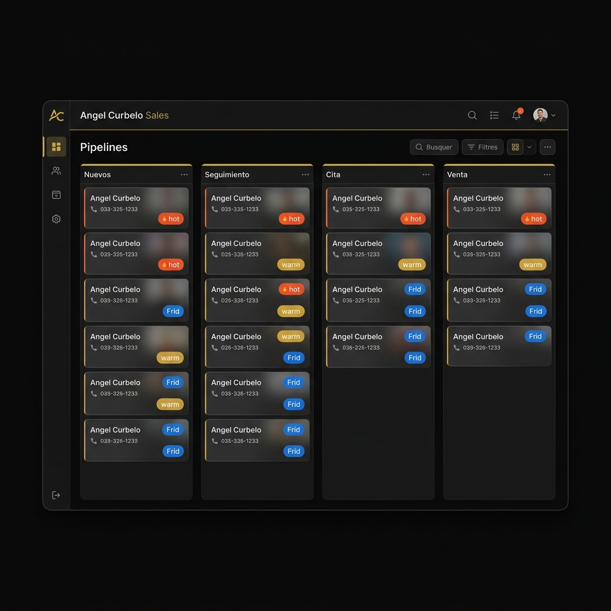
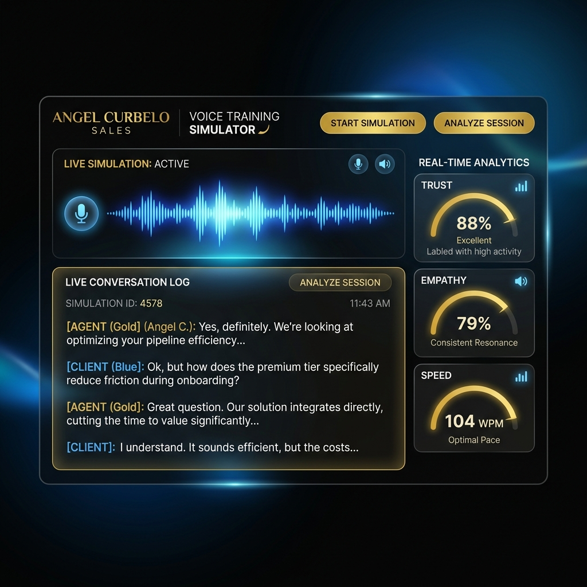

# 🏆 MANUAL DE USUARIO PREMIUM
## ANGEL CURBELO SALES: GESTIÓN DE SOLUCIONES PARA EL HOGAR

---

## 🏛️ Filosofía del CRM y Portafolio Premium

El **Angel Curbelo Sales CRM** ha sido diseñado bajo los estándares más exigentes de la industria de venta directa y telemercadeo en Puerto Rico. La filosofía de este sistema no es simplemente almacenar registros, sino actuar como un **acelerador comercial inteligente** que une la calidez del habla puertorriqueña con la automatización táctica de última generación.

El CRM centraliza e impulsa la comercialización del portafolio premium de soluciones para el hogar de Ángel Curbelo:
*   **☀️ Energía Solar (TuPlanta.com):** Sistemas de placas solares y almacenamiento contra los apagones de LUMA, apalancando ofertas de cero pronto ($0 Down).
*   **🔋 Baterías de Respaldo (Zendure):** Soluciones de almacenamiento energético *Plug & Play* (SuperBase V, SuperBase Pro), ideales para apartamentos y casas sin requerir permisos complejos.
*   **🌪️ Purificación de Aire (Rainbow):** Sistemas certificados Rainbow SRX que utilizan agua en movimiento y filtros HEPA para sanitizar el aire, previniendo asma y alergias.
*   **🏠 Filtración y Bienestar de Agua (H&H Distributors):** Soluciones de alta ingeniería como *Water Tree* (agua alcalina digital), *Triple Treated Water* (suavizadores de agua) y *Aqua Viva* para depurar el agua del hogar completo.

---

## 💻 Introducción Técnica e Interfaz de Usuario (UI)

La interfaz del CRM ha sido desarrollada bajo una estética de **Lujo Digital (Dark Mode)** con acentos en oro brillante (`#d4af37`) y técnicas de *glassmorphism* (paneles semitransparentes sobre fondos oscuros).



### Estructura de Navegación y Roles
El sistema cuenta con un control de acceso basado en roles gestionado a través de **Firebase Authentication** y perfiles en **Cloud Firestore**. Los roles disponibles y sus privilegios son:

| Rol | Descripción | Secciones Disponibles |
| :--- | :--- | :--- |
| **Master** | Control Maestro HQ | Acceso absoluto a todos los leads del sistema, creador de usuarios, visualización de todos los clientes asociados, analíticas globales e integraciones. |
| **Admin** | Administrador | Gestión de leads del cliente asignado, descarga de reportes, visualización de analíticas y configuración de landing pages. |
| **Staff** | Operaciones / Coordinación | Modificación de estados en el pipeline, agendamiento de citas en calendario y consulta de prospectos. |
| **Vendedor** | Cerrador | Gestión del pipeline personal, Academia de Ventas AI, Generador de Anuncios y Códigos QR de captación. |

> [!NOTE]
> **Vista de Control Master:** Los usuarios con el rol `master` tienen un componente exclusivo denominado **Context Switcher** en la barra lateral. Este selector les permite cambiar de forma instantánea entre la visualización global y las bases de datos individuales de los representantes asociados (ej. Angel Curbelo, Papi Solar, etc.).

---

## 📦 Módulo 1: Pipeline y Gestión de Prospectos

El flujo de ventas (Pipeline) está estructurado en 4 columnas principales que reflejan el estado del embudo comercial en tiempo real:



1.  **📮 NUEVOS / POR CONTACTAR:** Leads que acaban de ingresar al sistema desde los cuestionarios web o integraciones telefónicas.
2.  **⏳ EN SEGUIMIENTO / CITA:** Clientes que ya han sido contactados y están en fase de cotización o tienen una cita programada.
3.  **✅ VENTA / POST-VENTA:** Contratos aprobados e instalaciones completadas listas para el servicio de fidelización.
4.  **🚫 ARCHIVO (NO CUALIFICADOS):** Prospectos descartados por reglas automáticas de calificación.

### Reglas de Auto-Archivo y Descarte
Para proteger el tiempo de los cerradores de ventas, el sistema procesa los datos ingresados y puede archivar automáticamente o etiquetar prospectos según los siguientes criterios de exclusión:
*   **No Califica: Renta:** Cuando el prospecto declara rentar la propiedad en lugar de ser dueño (*isOwner = No*), específicamente en la vertical solar.
*   **No Califica: Apartamento:** Cuando el prospecto busca energía solar pero vive en un apartamento que no permite la instalación de paneles en techo propio.
*   **no_cualificado / Denegado:** Prospectos con crédito gravemente afectado o que declaran explícitamente no tener interés durante el contacto telefónico.

### Puntuación de Leads (Lead Scoring)
El CRM asigna automáticamente una etiqueta de calidad al prospecto:
*   🔥 **Hot Lead (Crédito Excelente 700+ o 750+):** Califica directamente para financiamiento solar sin pronto pago.
*   ☀️ **Warm Lead (Crédito Bueno 651-749 o Propietario confirmado):** Alto potencial de cierre, requiere evaluación de deudas.
*   ❄️ **Cold Lead (Crédito <650 o Inquilino):** Baja prioridad de conversión inmediata.

### Importación Manual y Escáner Inteligente (OCR)
Los leads pueden ser añadidos mediante un formulario manual detallado o escaneando una lista física de prospectos con la cámara:
1.  Haz clic en **Añadir Usuarios/Leads**.
2.  En la tarjeta **Escanear Foto / Documento**, arrastra una foto o haz clic para tomar una foto de tus hojas de trabajo.
3.  El sistema utiliza la función cloud `extractLeadsFromImage` (impulsada por Gemini Vision y OpenAI) para leer los datos, extraer nombres, teléfonos y municipios, y presentarlos en una tabla interactiva para que los guardes en el CRM con un solo clic.

---

## 📞 Módulo 2: Telefonía Inteligente (Squad Vapi.ai)

El CRM se conecta a la API de **Vapi.ai** mediante un ecosistema multi-asistente (Squad) que responde y realiza llamadas salientes de forma autónoma.

```text
               [ Número Telefónico VIP (787 / 305) ]
                           │
                           ▼
             🤖 0. RECEPCIONISTA CENTRAL (Host)
        "¡Hola! Bienvenido a Angel Curbelo Sales..."
                           │
    ┌──────────────┬───────┴──────┬──────────────┐
    ▼              ▼              ▼              ▼
🤖 1. SOLAR   🤖 2. BATERÍAS   🤖 3. RAINBOW   🤖 4. AGUA H&H
```

### Configuración en el Dashboard de Vapi

> [!IMPORTANT]
> Para garantizar que el delay de conversación sea mínimo y los asistentes entiendan el acento caribeño, la pestaña **Transcriber** de los 5 asistentes debe configurarse con el proveedor **Deepgram** o **Google (Gemini 2.0 Flash Lite)** en idioma **Spanish (es-PR o es-US)**. Nunca dejes el idioma en inglés para evitar cortes por silencio.

#### Los 5 Asistentes del Squad:
*   **Asistente 0: Recepcionista Central (Anfitriona):**
    *   *Misión:* Recibir la llamada entrante de forma cordial, filtrar el interés y transferir de inmediato al especialista.
    *   *System Prompt:* *"Eres la Recepcionista Central de Angel Curbelo Sales en Puerto Rico. Da la bienvenida en español caribeño y usa la herramienta handoff_tool para transferir al usuario en cuanto identifiques si busca Placas, Baterías, Rainbow o Filtros de Agua."*
*   **Asistente 1: Experto Solar (TuPlanta.com):**
    *   *Misión:* Precalificar de forma consultiva preguntando el promedio de la factura de LUMA, pueblo, si es propietario, material del techo y rango de crédito.
*   **Asistente 2: Experto Baterías (Zendure):**
    *   *Misión:* Ofrecer sistemas de respaldo energéticos compactos para casas y apartamentos, identificando qué enseres críticos desea respaldar el cliente.
*   **Asistente 3: Experto Rainbow:**
    *   *Misión:* Enfocado en la desinfección y salud familiar (asma, alergias y mascotas) agendando demostraciones gratuitas del purificador SRX en el hogar.
*   **Asistente 4: Experto Agua (H&H):**
    *   *Misión:* Detectar problemas comunes del agua (olor a cloro, sarro, mal sabor) y ofrecer pruebas gratuitas de calidad de agua a domicilio.

### Música de Transición y Transferencia de Llamada
Para evitar silencios incómodos mientras la llamada se transfiere entre agentes virtuales, se configura la herramienta de Vapi `handoff_to_assistant` con las siguientes propiedades:
*   **Mensaje de Inicio (`request-start`):** *"Perfecto, permítame un momento en la línea mientras conecto su llamada con el especialista en esa área..."*
*   **Música de Espera (`Hold Audio`):** Pega este enlace directo a un archivo de música suave: `https://cdn.pixabay.com/audio/2022/11/03/audio_40475141e5.mp3`.

### Agendamiento Automático de Citas (Google Calendar)
Cuando un asistente de voz identifica que el cliente está listo para recibir la visita o la llamada de Angel Curbelo, invoca la herramienta `agendar_cita`.

#### Parámetros obligatorios de la Tool `agendar_cita` en Vapi:
```json
{
  "type": "object",
  "properties": {
    "name": { "type": "string", "description": "Nombre y apellido del cliente." },
    "phone": { "type": "string", "description": "Número de teléfono." },
    "date": { "type": "string", "description": "Fecha de la cita (YYYY-MM-DD)." },
    "time": { "type": "string", "description": "Hora de la cita militar (HH:MM)." },
    "service": { "type": "string", "enum": ["solar", "zendure", "rainbow", "agua_hh"] },
    "notes": { "type": "string", "description": "Observaciones o peticiones." }
  },
  "required": ["name", "date", "time"]
}
```
*   **Endpoint Webhook:** `https://us-central1-angel-curbelo-sales-crm.cloudfunctions.net/vapiAppointmentWebhook`
*   **Funcionamiento:** Vapi envía el payload a Firebase Cloud Functions, la función busca o crea el lead, cambia su estado a `"Cita"`, guarda la fecha/hora en la ficha del lead y dispara un webhook a **Make.com** para bloquear el espacio en el **Google Calendar** de Angel Curbelo y despachar un recordatorio por WhatsApp de forma simultánea.

---

## 🎓 Módulo 3: Academia de Ventas AI (Entrenamiento)

Un cerrador premium debe estar en constante evolución. El CRM incluye herramientas interactivas de capacitación en la pestaña **Entrenamiento**:

### 1. Biblioteca de Objeciones
Colección de estrategias psicológicas basadas en datos de telemercadeo exitoso:
*   **Micro-empatía:** Conectar emocionalmente con el dolor financiero del cliente. *Ejemplo:* *"Ese pago de luz mensual de $250 es prácticamente el pago de un carro nuevo"*.
*   **Venta de Privilegio:** Elevar el valor percibido del prospecto usando palabras como "VIP", "Seleccionado", "Preventa de Zona".
*   **Control Suave:** Evitar interrogatorios. Dirigir la llamada dando opciones cerradas (ej. *"¿Prefiere recibir al ingeniero el martes a las 3:00 o el jueves a las 5:00?"*).

### 2. Mapa de Dolores
Mapeo exacto entre el dolor expresado y la solución a vender:
*   *Dolor:* Factura Alta de LUMA ➡️ *Venta:* Ahorro VIP y congelación de tarifa.
*   *Dolor:* Apagones constantes ➡️ *Venta:* Garantía de continuidad de vida y electrodomésticos.
*   *Dolor:* Asma y condiciones de salud ➡️ *Venta:* Prevención certificada por purificación de aire Rainbow.

### 3. Certificación AC Sales
Un examen interactivo compuesto por preguntas de opción múltiple basadas en el manual de ventas. El vendedor debe completar el quiz y obtener una puntuación mínima de **90%** para ser certificado en la plataforma y recibir la asignación de leads VIP en vivo.

### 4. Simulador de Voz IA



Esta herramienta utiliza el micrófono de la computadora para simular una llamada de captación telefónica real. El vendedor interactúa verbalmente con una IA que adopta diferentes personalidades y dificultades en tiempo real:
*   🗣️ **Escéptico (Fácil):** Pone objeciones comunes sobre el costo.
*   💼 **Ocupado (Medio):** Intenta colgar rápido, exige brevedad.
*   🤬 **Enojado (Difícil):** Habla con tono áspero y rechaza el libreto estructurado.
*   🚫 **El "Ni me interesa" (Experto):** Bajas defensas, tono cortante.

#### Métricas de Feedback Analizadas por la IA:
*   ⚡ **Velocidad:** Evalúa si el vendedor habla de manera pausada y profesional o si muestra ansiedad.
*   🤝 **Empatía:** Califica la capacidad de validar las emociones o quejas del cliente antes de responder.
*   🎮 **Control:** Mide si el vendedor mantiene el liderazgo de la conversación o si cede el control al cliente.
*   📈 **Nivel de Confianza (Trust Meter):** Una barra visual dinámica de 0% a 100% que sube o baja de acuerdo al desempeño del representante durante la simulación.

---

## 📣 Módulo 4: Herramientas de Marketing

El CRM permite estructurar anuncios profesionales de alto impacto y compartirlos con un solo clic.

### Generador de Campañas
Este panel de automatización permite seleccionar la plataforma social (**Facebook, Instagram, TikTok**), la vertical de servicio y el enfoque creativo del anuncio (concientización, oferta, reclutamiento) para generar variaciones de copies atractivos e imágenes/videos persuasivos listos para publicar.

### Acción One-Click (Copiar y Descargar)
Al hacer clic en el botón dorado **🚀 COPIAR Y DESCARGAR**, el CRM realiza dos acciones en paralelo:
1.  Descarga el recurso multimedia (imagen PNG o video MP4) del anuncio a la carpeta de descargas de tu PC o móvil.
2.  Copia automáticamente el copy persuasivo redactado con emojis al portapapeles, reduciendo el tiempo de publicación a menos de 5 segundos.

### Código QR Oficial y Flyers Promocionales
En la sección **Código QR Oficial**, puedes seleccionar el vertical deseado (Solar, H&H, Rainbow):
*   El sistema renderiza un código QR dinámico conectado al formulario de precalificación (`cuestionario.html`).
*   Puedes descargar el **Código QR en alta definición (PNG)** o generar un **Flyer Digital Promocional (1080x1080px)** optimizado para estados de WhatsApp y volantes impresos. El flyer integra automáticamente el código QR y los datos de contacto del representante de ventas.

---

## 📊 Módulo 5: Analíticas y Reportes

El CRM procesa el comportamiento de las ventas y la distribución de los leads, proyectando la información de manera visual y ejecutiva en el dashboard.

### Gráficos Dinámicos (Chart.js)
*   **Distribución por Producto (Doughnut):** Gráfico circular interactivo que desglosa el porcentaje de prospectos interesados en placas solares, baterías Zendure, Rainbow o filtros H&H.
*   **Estado del Embudo (Bar):** Gráfico de barras que ilustra visualmente cuántos prospectos se encuentran en fase de *Nuevo*, *En Seguimiento*, *Cita Agendada* o *Venta Cerrada*.

### Exportación de Datos
El CRM cuenta con tres métodos nativos de exportación ubicados en la cabecera de la sección de leads:
*   🟢 **Excel / CSV:** Descarga un archivo estructurado con todos los leads de la vista actual.
*   🔵 **Copiar para Sheets:** Copia el listado formateado con tabulaciones en el portapapeles, permitiendo pegarlo directamente (`CTRL+V`) en cualquier documento de **Google Sheets**.
*   🔴 **Imprimir PDF:** Formatea y limpia la pantalla aplicando una hoja de estilos de impresión especial (`@media print`), ocultando menús y barras laterales para generar un reporte limpio y listo para imprimir en papel o guardar en formato PDF.

---

## ⚙️ Módulo 6: Configuración e Integraciones Técnicas

Para el correcto funcionamiento del ecosistema, el CRM interactúa de forma fluida con las siguientes plataformas de infraestructura:

```text
┌─────────────┐       ┌─────────────────┐       ┌──────────────┐
│   Vapi.ai   │ ────> │ Cloud Functions │ ────> │  Firestore   │
└─────────────┘       └─────────────────┘       └──────────────┘
                               │
                               ▼
                      ┌─────────────────┐       ┌──────────────┐
                      │    Make.com     │ ────> │ G. Calendar  │
                      └─────────────────┘       └──────────────┘
                               │
                               ▼
                      ┌─────────────────┐
                      │    Green API    │ ────> │  WhatsApp    │
                      └─────────────────┘
```

### 1. Firebase (Infraestructura Principal)
*   **Firestore Database:** Almacena la colección `leads`, la colección de auditoría `logs` y los datos de facturación de la IA bajo `usage`.
*   **Cloud Functions (V2):**
    *   `onNewLead`: Se dispara al crear un nuevo lead, formatea los datos y envía notificaciones automáticas por WhatsApp al administrador y a Make.com.
    *   `generateAIAsset`: Controla las peticiones de copies e imágenes a la API de OpenAI y Gemini, limitando el presupuesto a un máximo de **$5.00** por cliente para evitar sobrecostos accidentales.
    *   `vapiAppointmentWebhook` / `scheduleLeadAppointment`: Webhooks receptores que procesan el agendamiento de citas en vivo desde el agente de voz.

### 2. Integración con Make.com
Cuando se crea un lead o se agenda una cita, Firebase envía un payload POST a la URL de Make.com (`MAKE_WEBHOOK_URL`). Este flujo ejecuta:
*   Creación del evento en el calendario de Google Calendar.
*   Validación de disponibilidad horaria del asesor.
*   Notificaciones avanzadas por correo electrónico al cliente.

### 3. WhatsApp (Green API)
Para evadir las restricciones de la API oficial de Meta, las alertas internas se despachan utilizando **Green API**:
*   La función requiere las variables de entorno `GREEN_API_HOST`, `GREEN_API_ID` y `GREEN_API_TOKEN`.
*   Envía automáticamente un WhatsApp estructurado con los datos clave del cliente precalificado al número principal asignado (`17874596147`) inmediatamente después de registrar el lead.

---

> [!TIP]
> **Recomendación de Seguridad:** Las claves API y credenciales de acceso de Firebase, Green API y OpenAI se configuran exclusivamente a través del Administrador de Secretos de Google Cloud o el archivo de variables `.env` de las Cloud Functions. Nunca expongas credenciales en código del cliente frontend.
